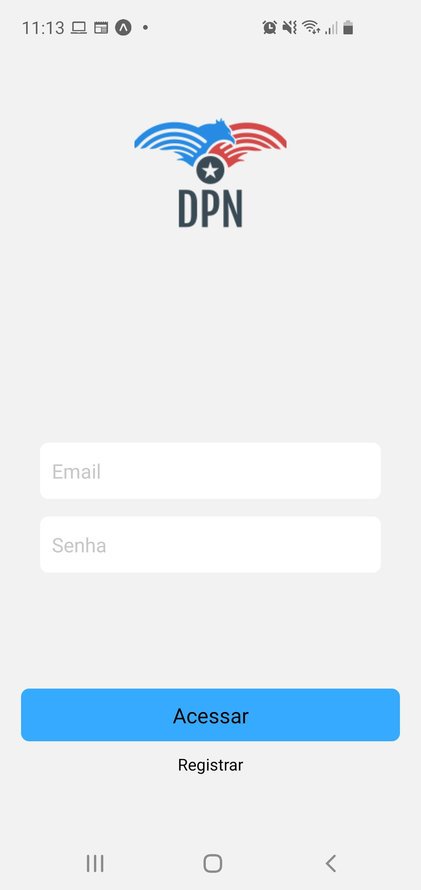
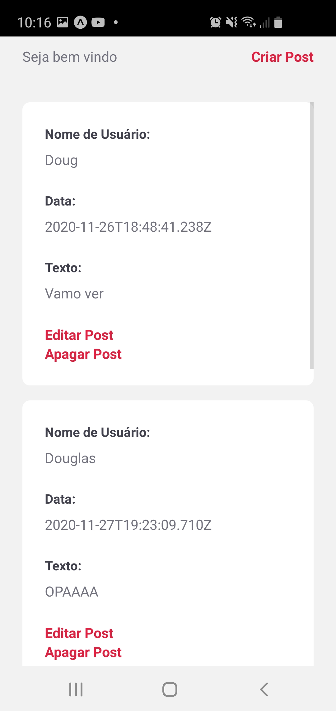
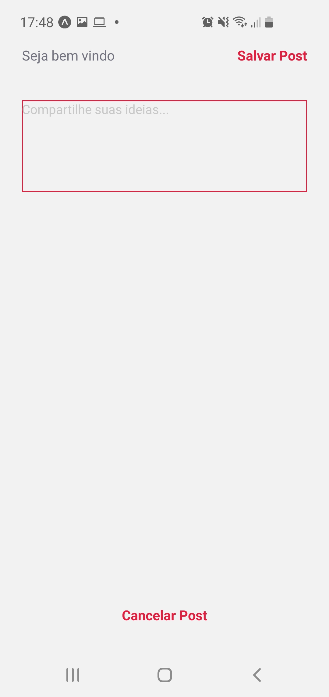

<h1 align="center">Palrador Ideal</h1>

<p align="center">Uma rede social que visa facilitar a troca de idéias libertárias</p>

<p align="center">
 <a href="#objetivo">Objetivo</a> •
 <a href="#funções">Funções</a> • 
 <a href="#tecnologias">Tecnologias</a> • 
 <a href="#licenc-a">Licença</a> • 
 <a href="#autor">Autor</a>
</p>

<h4 align="center"> 
	🚧  Parlador Ideal em construção...  🚧
</h4>

<p align="center">




</p>

### Funções

- [x] Cadastro de usuário
- [ ] Autenticação do usuário
- [x] Exclusão de posts
- [x] Criação de novos posts
- [x] Edição de posts

### Pré-requisitos

Antes de começar, você vai precisar ter instalado em sua máquina as seguintes ferramentas:
[Git](https://git-scm.com), [Node.js](https://nodejs.org/en/). 
Além disto é bom ter um editor para trabalhar com o código como [VSCode](https://code.visualstudio.com/)

### Rodando o Mobile

```bash
# Clone este repositório
$ git clone <https://github.com/dougpn/palradorfrontend>

# Acesse a pasta do projeto no terminal/cmd
$ cd palradorfrontend

# Instale as dependências
$ npm install

# Execute a aplicação em modo de desenvolvimento
$ npm start

# O servidor inciará na porta:19002 - acesse <http://localhost:19002>
```
### Tecnologias

As seguintes ferramentas foram usadas na construção do projeto:

- [Expo](https://expo.io/)
- [React](https://pt-br.reactjs.org/)
- [React Native](https://reactnative.dev/)
- [React Native Gesture Handler](https://docs.swmansion.com/react-native-gesture-handler/)
- [React Navigation](https://reactnavigation.org/)

### Autor

<a href="https://github.com/dougpn/">
 
 <br />
 <sub><b>Douglas Neves</b></sub></a> <a href="https://github.com/dougpn" ></a>


Feito com ❤️ por Douglas Neves 👋🏽 Entre em contato!

[](https://www.linkedin.com/in/douglaspneves/) 
[](mailto:nevesdouglasp@gmail.com)
